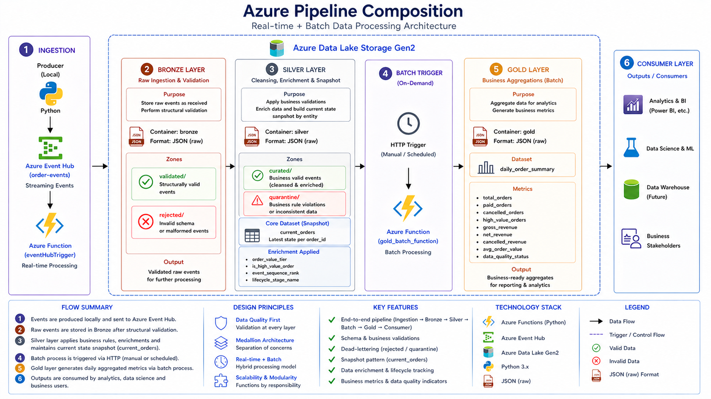

<p align="center">
  
</p>

<h1 align="center">Azure Event-Driven Data Pipeline</h1>

<p align="center">
  Event-driven order ingestion on Azure with Event Hubs, Azure Functions, ADLS Gen2, progressive validation, current-state modeling, and Gold business aggregation.
</p>

<p align="center">
  <a href="docs/architecture/overview.md">Architecture</a> |
  <a href="docs/data_flow/end_to_end_flow.md">Data Flow</a> |
  <a href="docs/evidence_index.md">Evidence</a> |
  <a href="docs/testing_scenarios/testing_scenarios.md">Testing</a> |
  <a href="docs/known_limitations_and_future_improvements.md">Limitations</a>
</p>

---

## The problem

Event-driven systems do not become trustworthy simply because messages arrive successfully.

A useful ingestion pipeline also needs to answer:

- What happens when incoming events are malformed?
- Where do business-rule violations go?
- How is the latest state of an entity reconstructed from multiple events?
- Can batch metrics be computed only from trusted state?
- Can each stage be inspected and validated independently?
- How are real-time ingestion and batch aggregation separated cleanly?

This project focuses on those questions through a small retail-order event domain.

## The idea

The pipeline uses Azure Event Hubs for event ingestion and Azure Functions for processing.

Data is progressively refined through a medallion-style flow:

```text
Python event producer
        ↓
Azure Event Hubs
        ↓
Azure Functions
        ↓
Bronze
  ├── validated
  └── rejected
        ↓
Silver
  ├── curated
  ├── quarantine
  └── current_orders
        ↓
Gold batch
  └── daily_order_summary
```

The implementation intentionally uses **JSON across all layers** so the project remains easy to inspect, debug, and explain.

## At a glance

| Area | Implementation |
|---|---|
| Cloud platform | Microsoft Azure |
| Event ingestion | Azure Event Hubs |
| Processing | Azure Functions / Python |
| Storage | Azure Data Lake Storage Gen2 |
| Architecture | Bronze / Silver / Gold medallion-style flow |
| Bronze behavior | Structural validation + rejected records |
| Silver behavior | Transformation, business validation, enrichment, quarantine |
| Stateful model | `silver/current_orders` latest-state snapshot |
| Gold behavior | HTTP-triggered batch aggregation |
| Test strategy | Controlled producer scenarios |
| Storage format | JSON |
| Partitioning | Year / month / day folder structure |
| Local secret handling | `local.settings.json` excluded from Git |
| Project status | Completed / portfolio-ready foundation project |

## Architecture

<p align="center">
  
</p>

The architecture intentionally separates:

- event production;
- event ingestion;
- structural validation;
- business validation;
- current-state reconstruction;
- batch aggregation;
- analytical consumption.

See [Architecture](docs/architecture/overview.md) and [Medallion Design](docs/architecture/medallion_design.md).

## Data-quality flow

### Bronze

Bronze preserves event payloads while applying structural validation.

```text
valid structure   → bronze/validated
invalid structure → bronze/rejected
```

### Silver

Silver performs business validation, normalization, and enrichment.

```text
business-valid record   → silver/curated
business-rule violation → silver/quarantine
```

### Current-state snapshot

Validated Silver records update `silver/current_orders`, which maintains one current representation per `order_id`.

Lifecycle progression is modeled across events such as:

```text
order_created → CREATED
payment_confirmed → PAID
order_cancelled → CANCELLED
```

### Gold

Gold is executed separately as a batch operation and reads trusted current-order state rather than raw events.

It produces `gold/daily_order_summary` with metrics such as:

- total orders;
- paid orders;
- cancelled orders;
- high-value orders;
- gross revenue;
- net revenue;
- cancelled revenue;
- average order value.

## Testing strategy

The producer contains controlled scenarios for validating pipeline behavior:

| Scenario | Primary validation |
|---|---|
| `paid_order` | Normal lifecycle to PAID |
| `cancelled_order` | Cancellation path |
| `paid_then_cancelled` | Multi-event lifecycle progression |
| `open_order` | Current-state persistence |
| `high_value_paid` | Enrichment + Gold metrics |
| `zero_amount` | Silver quarantine |
| `bad_currency` | Silver quarantine |
| `bad_status` | Invalid business state |

The `portfolio_demo_batch` scenario exercises all major paths in one controlled run.

See [Testing Scenarios](docs/testing_scenarios/testing_scenarios.md).

## Evidence

Execution proof already exists across the repository and is indexed centrally in:

[Evidence Index](docs/evidence_index.md)

The evidence set includes:

- event producer output;
- Azure Function startup;
- Bronze validated / rejected examples;
- Silver curated / quarantine outputs;
- current-order snapshot validation;
- Gold batch execution;
- Gold business-metric outputs;
- end-to-end test scenarios.

Evidence is used to prove pipeline behavior, not merely that resources exist.

## Security boundary

The code reads connection values from environment variables / `local.settings.json`; secrets are not hardcoded in committed Python files.

`local.settings.json` is excluded by `.gitignore`.

This MVP uses connection-string-based local authentication for Event Hubs and storage. Managed Identity, Key Vault integration, private networking, and production-grade identity hardening are documented as future improvements rather than implemented capabilities.

## Cost awareness

The project uses lightweight Azure components and separates event-driven ingestion from on-demand Gold aggregation.

Cost and cleanup considerations are documented in:

[Cost Controls](docs/cost_controls.md)

## Known limitations

This is a focused portfolio MVP, not a production-ready enterprise event platform.

Important boundaries include:

- JSON rather than Parquet / Delta;
- local connection-string authentication;
- no Infrastructure as Code;
- no CI/CD deployment automation;
- no dead-letter service beyond repository-level rejected/quarantine routing;
- no production monitoring or alerting;
- no schema registry;
- no guaranteed exactly-once processing semantics.

See [Known Limitations & Future Improvements](docs/known_limitations_and_future_improvements.md).

## Documentation

| Area | Document |
|---|---|
| Architecture | [Architecture Overview](docs/architecture/overview.md) |
| Medallion strategy | [Medallion Design](docs/architecture/medallion_design.md) |
| Event contract | [Event Contract & Producer](docs/ingestion/event_contract.md) |
| Bronze | [Bronze Layer](docs/bronze/bronze_layer.md) |
| Silver | [Silver Layer](docs/silver/silver_layer.md) |
| Snapshot | [Current Orders Snapshot](docs/silver/current_orders_snapshot.md) |
| Gold | [Gold Layer](docs/gold/gold_layer.md) |
| Metrics | [Metrics Definition](docs/gold/metrics_definition.md) |
| Execution | [Pipeline Execution](docs/data_flow/pipeline_execution.md) |
| End-to-end flow | [Pipeline Flow](docs/data_flow/end_to_end_flow.md) |
| Testing | [Testing Scenarios](docs/testing_scenarios/testing_scenarios.md) |
| Design decisions | [Design Decisions](docs/design_decisions/design_decisions.md) |
| Evidence | [Evidence Index](docs/evidence_index.md) |
| Limitations | [Known Limitations & Future Improvements](docs/known_limitations_and_future_improvements.md) |

## Repository structure

```text
.
├── README.md
├── function_app.py
├── producer/
├── app/
│   ├── bronze/
│   ├── silver/
│   ├── gold/
│   └── shared/
├── docs/
├── samples/
├── host.json
└── requirements.txt
```

## Why this project matters

This repository is the foundation project in the Azure portfolio.

Its value is not scale. Its value is demonstrating, in a compact system, the core data-engineering progression:

> **events → validation → trusted state → business metrics**

Later portfolio projects expand this foundation with ADF, Databricks/Delta, Synapse, production readiness, real-time analytics, and governance.

## Status

**Completed / portfolio-ready foundation project.**
