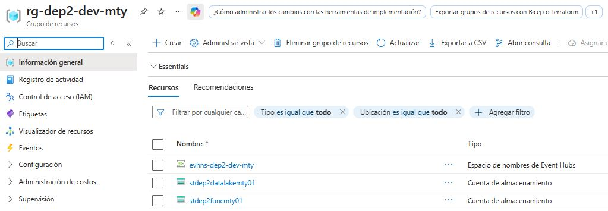

<p align="center">
<a href="../../README.md">Home</a>
</p>

# Architecture

<p align="center">
  
</p>

## 1. Scope

This pipeline is composed of six main architectural blocks:

| Component | Role |
|-----------|------|
| 📥 [Ingestion](docs/ingestion/event_contract.md) | Produces and captures order events |
| 🥉 [Bronze Layer](docs/bronze/bronze_layer.md) | Stores raw data and applies structural validation |
| 🥈 [Silver Layer](docs/silver/silver_layer.md) | Cleanses, validates, enriches, and models current state |
| ⚙️ Batch Trigger| Executed on demand (HTTP / Terminal)  |
| 🥇 [Gold Layer](docs/gold/gold_layer.md) | Generates business-ready aggregated datasets |
| 📤 Consumer Layer | Represents downstream analytical consumers |

## 2. Azure Components

All components were created inside the Resource Group `rg-dep2-dev-mty`



## 3. Data Lake Organization

ADLS Gen2 containers obey this structure:

```text
Azure Data Lake Storage Gen2
├── bronze/
│   ├── validated/
│   └── rejected/
│
├── silver/
│   ├── curated/
│   ├── quarantine/
│   └── current_orders/
│
└── gold/
    └── daily_order_summary/
```

Each zone uses date-based partitioning:
```text
└── year=YYYY/
    └── month=MM/
        └── day=DD/
```

## 4. Principles

| Principle |	Description |
|-----------|-------------|
|Data Quality First	| Validation is applied before data moves downstream |
| Medallion Architecture | Data is refined progressively across layers |
| Real-Time + Batch | Streaming ingestion is separated from analytical aggregation |
| Scalability & Modularity | Each component has a specific responsibility |
| Traceability | Raw, rejected, quarantined, curated, and aggregated records are preserved separately |

## 5. Technology Stack
| Component | Technology |
|-----------|------------|
| Event Producer | Python |
| Streaming Ingestion| Azure Event Hub |
| Real-Time Processing | Azure Functions |
| Storage | Azure Data Lake Storage Gen2 |
| Batch Processing | HTTP-triggered Azure Function |
| Data Format | JSON |

## 6. Summary

This architecture separates the pipeline into clear components, each with a specific responsibility.

The model is designed to demonstrate how Azure services can be combined to implement a Medallion-style data pipeline with:

* Event-driven ingestion
* Layered data validation
* Stateful entity modeling
* Batch aggregation
* Analytics-ready outputs
