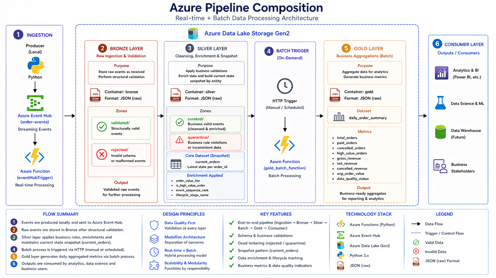

<p align="center">
  
</p>

## 1. Overview

This project implements a **production-style event-driven data pipeline** using Azure-native services, following the **Medallion Architecture pattern (Bronze → Silver → Gold)**.

The system is designed to:

* Ingest high-frequency transactional events in real time
* Enforce **data quality at multiple stages**
* Maintain a **stateful representation of business entities**
* Generate **aggregated, analytics-ready datasets**

This architecture reflects real-world data engineering scenarios where **data reliability, traceability, and scalability** are critical.

---

## 2. Architectural Style

The pipeline follows a **hybrid processing model**:

| Processing Type       | Purpose                                     |
| --------------------- | ------------------------------------------- |
| Real-time (Streaming) | Event ingestion, validation, enrichment     |
| Batch (On-demand)     | Aggregation and business metrics generation |

### Key Pattern:

* **Event-driven ingestion** using Azure Event Hub
* **Layered data refinement** using Medallion Architecture
* **Stateful modeling** via entity snapshot (current_orders)
* **Separation of concerns** between ingestion and analytics

---

## 3. High-Level Flow

The pipeline operates as follows:

1. Events are produced and sent to Event Hub
2. Azure Function processes events in real time
3. Data is validated and stored in Bronze layer
4. Business logic is applied in Silver layer
5. A snapshot of current entity state is maintained
6. Batch process generates aggregated metrics in Gold layer

### Execution Entry Points:

* Real-time processing:

  * `sales_ingest_function` 
* Batch processing:

  * `gold_batch_function` 

---

## 4. Core Components

### 4.1 Event Producer

A local simulator generates events with multiple business scenarios:

* Valid lifecycle events (created → paid → cancelled)
* Edge cases (zero amount, invalid currency, invalid status)

Reference:

* `producer/send_sales_events.py` 

---

### 4.2 Event Ingestion (Azure Event Hub)

Event Hub acts as the **entry point of the pipeline**, decoupling producers from processing logic.

Responsibilities:

* High-throughput event ingestion
* Durable buffering of events
* Decoupled scaling between producers and consumers

---

### 4.3 Real-Time Processing (Azure Functions)

The ingestion function orchestrates the pipeline:

* Parses incoming events
* Validates schema (Bronze)
* Transforms data (Silver)
* Applies business validation
* Maintains current state (snapshot logic)

Key flow:

```text
Event Hub → Function → Bronze → Silver → Snapshot
```

---

### 4.4 Data Lake Storage (ADLS Gen2)

All data is persisted in **Azure Data Lake Storage Gen2**, using:

* Layered containers (bronze, silver, gold)
* Partitioned folder structure:

  * `year=YYYY/month=MM/day=DD`

Partitioning logic:

* Implemented in shared writer utility 
* Enables efficient querying and scalability

---

### 4.5 Bronze Layer (Raw Ingestion)

Purpose:

* Store raw events as received
* Perform **structural validation only**

Validation rules include:

* Required fields
* Payload structure
* Data types and constraints

Reference:

* `validate_event()` 

Outputs:

* `validated/`
* `rejected/`

---

### 4.6 Silver Layer (Cleansing & Enrichment)

Purpose:

* Apply business logic
* Normalize and enrich data
* Enforce **business-level validation**

Transformations include:

* Standardization of fields
* Derived attributes:

  * `order_value_tier`
  * `event_sequence_rank`
  * `lifecycle_stage_name`

Reference:

* `transform_to_silver()` 

Validation:

* Currency constraints
* Status constraints
* Order value rules

Reference:

* `validate_silver_record()` 

Outputs:

* `curated/`
* `quarantine/`

---

### 4.7 Snapshot Layer (current_orders)

The pipeline maintains a **stateful representation of each order**.

Instead of relying only on events, it builds a **latest-state snapshot per entity**.

Key logic:

* Prioritization by `event_sequence_rank`
* Tie-breaker by timestamp

Reference:

* `should_overwrite_current_order()` 

Snapshot builder:

* `build_current_order()` 

This enables:

* Efficient querying
* Simplified downstream analytics
* Deterministic business state

---

### 4.8 Gold Layer (Aggregations)

Purpose:

* Generate business-ready datasets
* Aggregate metrics by date and currency

Processing:

* Batch execution via HTTP trigger

Reference:

* `run_gold_batch_for_today()` 

Metrics generated:

* total_orders
* paid_orders
* cancelled_orders
* gross_revenue
* net_revenue
* avg_order_value

Output:

* Partitioned JSON datasets in `gold/`

---

## 5. Data Quality Strategy

Data quality is enforced at multiple levels:

| Layer  | Validation Type        |
| ------ | ---------------------- |
| Bronze | Schema validation      |
| Silver | Business validation    |
| Gold   | Aggregated consistency |

Invalid data is never discarded silently:

* Rejected → Bronze/rejected
* Quarantined → Silver/quarantine

---

## 6. Design Principles

The architecture is guided by the following principles:

* **Data Quality First**
  Validation is applied at every layer

* **Separation of Concerns**
  Each layer has a single responsibility

* **Scalability by Design**
  Partitioned storage and event-driven ingestion

* **Stateful Modeling**
  Snapshot layer enables efficient analytics

* **Extensibility**
  Modular Python structure allows easy evolution

---

## 7. Repository Structure Alignment

The architecture maps directly to the repository structure:

* `/app` → Processing logic (Bronze, Silver, Gold)
* `/producer` → Event generation
* `/docs` → Technical documentation
* `/tests` → Validation (optional extension)

Reference:

* Repository structure 

---

## 8. Summary

This pipeline demonstrates a **complete, production-oriented data engineering workflow**, including:

* Event-driven ingestion
* Multi-layer data validation
* Stateful entity modeling
* Batch aggregation
* Scalable storage design

It reflects real-world patterns used in modern data platforms and serves as a foundation for advanced extensions such as:

* Orchestration (ADF / Airflow)
* Data warehousing
* Streaming analytics
