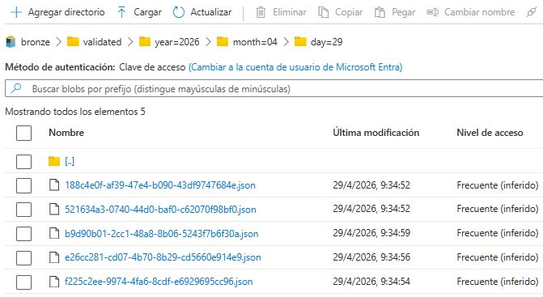
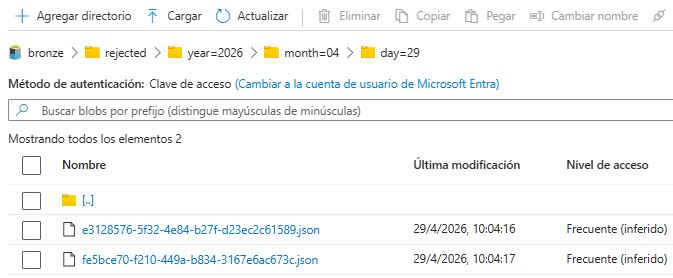

<p align="center">
<a href="../../README.md">Home</a> |
<a href="bronze_layer.md">Back</a>
</p>

# Bronze - Data Contract

## 1. Input Event

The Bronze layer receives events with the following structure:

```json
{
  "event_id": "string",
  "event_type": "string",
  "schema_version": "string",
  "source_system": "string",
  "event_time": "ISO8601",
  "payload": {
    "order_id": "string",
    "customer_id": "string",
    "order_total": "number",
    "currency": "string",
    "status": "string"
  }
}
```

---

## 2. Validated Output

Events that pass structural validation are stored here:

```text
└── container/
    └── bronze/
        └── validated/
            └── year=YYYY/
                └── month=MM/
                    └── day=DD/
```



This output confirms that:
- The event schema is correct
- Required fields are present
- Data is accepted for further processing

No transformations are applied at this stage.

---

## 3. Rejected Output

Events that fail structural validation are routed to the `rejected` zone wrapped with [error metadata](bronze_error_metadata.jpg).

Stored in: 
```text
└── container/
    └── bronze/
        └── rejected/
            └── year=YYYY/
                └── month=MM/
                    └── day=DD/
```


This output shows that:
- Invalid schema is detected
- Errors are captured and stored
- Original payload is preserved for traceability

---

## 4. Contract Rules

* The original event is never modified
* Invalid events are not discarded
* All rejected records retain full traceability
