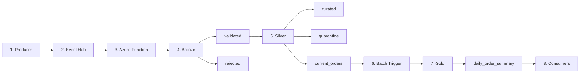

## End-to-End Pipeline Flow

## Overview

This document describes how data flows through the pipeline, from event generation to final business metrics.

The pipeline combines **real-time ingestion** and **batch aggregation**, following a Medallion Architecture.

---

## 1 — Ingestion 
### 1.1 — Event Generation

Events are generated by a Python-based producer.

These events simulate different order scenarios:

* Created, paid, cancelled
* Valid and invalid cases

They are sent to Azure Event Hub for ingestion.

Reference:

* `send_sales_events.py` → 

### 1.2 — Event Ingestion (Real-Time)

Events are consumed by an Azure Function:

* `sales_ingest_function` → 

This function orchestrates the initial stages of the pipeline:

* Parses incoming events
* Applies Bronze validation
* Routes data to the appropriate layer

## 2 — Bronze Layer

The event is validated at a structural level:

* Valid events → stored in `bronze/validated`
* Invalid events → stored in `bronze/rejected`

At this stage:

* No transformations are applied
* The original event is preserved

## 3 — Silver Layer 

Validated Bronze events are transformed into structured records.

Processing includes:

* Field normalization
* Business validation
* Data enrichment

Outputs:

* Valid records → `silver/curated`
* Invalid records → `silver/quarantine`

### Core Dataset — Snapshot

Each curated record is used to update the **current state of an order**.

Process:

* Build snapshot record
* Compare with existing state
* Apply overwrite logic based on event sequence and timestamp

Output:

```text
silver/current_orders/
```

At this stage, each order has a single **current representation**.

## 4 — Batch Processing

The Gold layer is executed on demand via an HTTP-triggered function:

Executed on demand via an HTTP-triggered function:

* `gold_batch_function` → 

It performs:

* Reading from `current_orders`
* Grouping by date and currency
* Computing business metrics

## 5 — Gold Layer

Aggregated datasets are stored in:

```text
gold/daily_order_summary/
```

These datasets are:

* Partitioned by date
* Ready for reporting and analytics

---

## Full Flow Summary

```text
Producer
   ↓
Event Hub
   ↓
Azure Function (Real-Time)
   ↓
Bronze
   ├── validated
   └── rejected
        ↓
Silver
   ├── curated
   ├── quarantine
   └── current_orders (snapshot)
        ↓
Gold (Batch)
   └── daily_order_summary
```

---

## Key Characteristics

* Real-time ingestion with event-driven processing
* Progressive data validation (Bronze → Silver)
* Stateful modeling via snapshot
* Batch-based aggregation for analytics
* Partitioned storage for scalability

---

## Summary

The pipeline transforms raw events into **business-ready insights** through a structured flow:

* Events → Validated data → Current state → Aggregated metrics

This design ensures:

* Data reliability
* Traceability
* Analytical consistency
