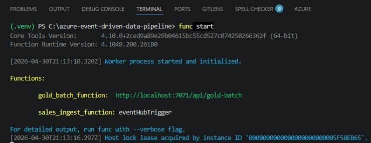

# How to Run the Pipeline

## 1. Overview

This document describes how to execute the pipeline locally, including:

* Event generation
* Real-time ingestion
* Batch aggregation (Gold layer)

---

## 2. Prerequisites

* Python 3.13
* Azure Functions Core Tools
* Azure Storage Account (Data Lake Gen2)
* Event Hub namespace

--- 

## 3. Environment Setup

### 3.1 Create virtual environment

```bash
python -m venv .venv
.\.venv\Scripts\Activate
```

### 3.2 Install dependencies

```bash
pip install -r requirements.txt
```

### 3.3 Configure environment variables

Edit `local.settings.json`:

```json
{
  "IsEncrypted": false,
  "Values": {
    "AzureWebJobsStorage": "DefaultEndpointsProtocol=https;AccountName=....",
    "FUNCTIONS_WORKER_RUNTIME": "python",
    "EVENT_HUB_CONNECTION": "Endpoint=sb://evhns-dep2-dev-mty.servicebus.windows.net/;SharedAccessKeyName=...",
    "DATALAKE_CONNECTION": "DefaultEndpointsProtocol=https;AccountName=...",
    "PRODUCER_EVENT_HUB_CONNECTION": "Endpoint=sb://evhns-dep2-dev-mty.servicebus.windows.net/..."
  }
}
```
> Use connection string acces on azure key management

---

## 4. Start the Pipeline (Real-Time Layer)

Run the Azure Function locally:

```bash
func start
```



## 5. Generate Events (Producer)

Run the event producer:

```bash
python producer/send_sales_events.py
```
[Producer results](producer_results.md)
 
This will:

* Send events to Event Hub
* Trigger real-time processing
* Populate Bronze and Silver layers

---

## 6. Execute Gold Layer (Batch)

### Option 1 — Browser

```text
http://localhost:7071/api/gold-batch
```


---

### Option 2 — PowerShell

```powershell
Invoke-RestMethod -Method POST http://localhost:7071/api/gold-batch
```


## 7. Validate Outputs

Check data in Azure Data Lake:

``` text
Azure Data Lake Storage Gen2
├── bronze/
│   ├── validated/
│   └── rejected/
├── silver/
│   ├── curated/
│   ├── quarantine/
│   └── current_orders/
└── gold/
    └── daily_order_summary/
```

---

## 8. Summary

This execution flow demonstrates a hybrid pipelinerunning this execution steps:

```text
1. Start Azure Function
2. Run producer
3. Validate Bronze & Silver outputs
4. Trigger Gold batch
5. Validate aggregated results
```


