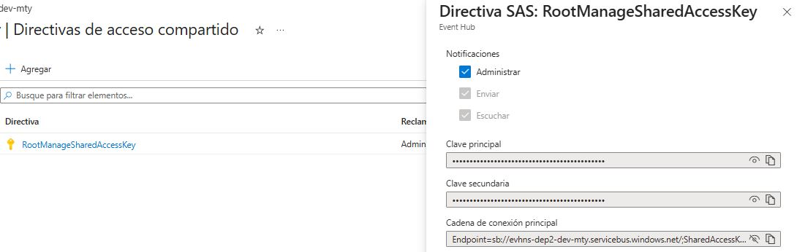
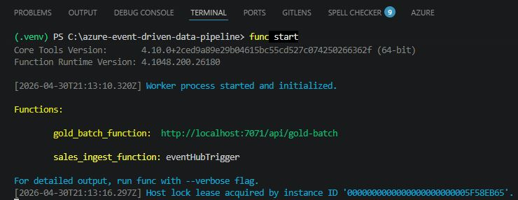
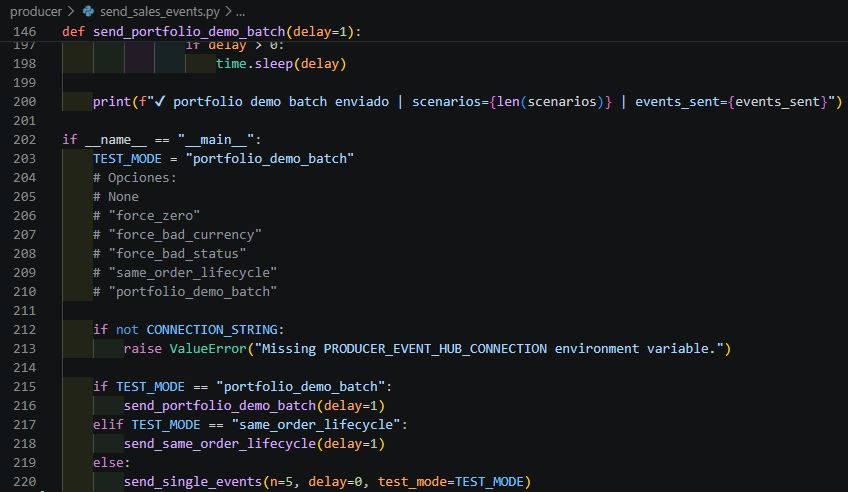
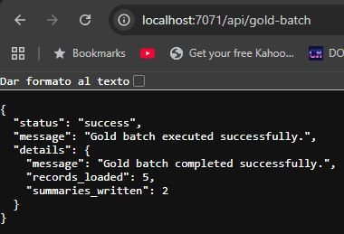
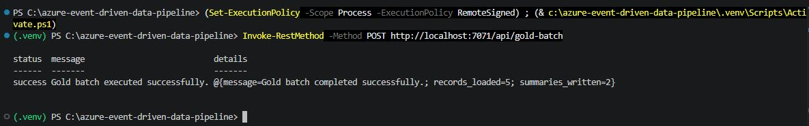

<p align="center">
<a href="../../README.md">Home</a>
</p>

# How to Run the Pipeline

## 1. Overview

This document describes how to execute the pipeline locally, including:

* Event generation
* Real-time ingestion
* Batch aggregation (Gold layer)

---

## 2. Pre-requisites

This are some of the resources needed to run this pipleline.
  * Python 3.13
  * Azure Functions Core Tools
  * Azure Storage Account (Data Lake Gen2)
  * Event Hub namespace

For full requirement list take a look at [requirements.txt](../../requirements.txt)

--- 

## 3. Environment Setup


### 3.1 Download repository

Identify & place repository on desired destination directory.

| Type | Item | Description |
|------|-----------|-------------|
| Directory | `\app` | Functions layers  |
| File | `\producer\send_sales_event.py`| Event producer |
| File| `\function_app.py` | Function container |

### 3.2 Create virtual environment

```bash
python -m venv .venv 
.\.venv\Scripts\Activate
```

### 3.3 Install dependencies

```bash
pip install -r requirements.txt
```

### 3.4 Configure environment variables

Edit `local.settings.json`:

```json
{
  "IsEncrypted": false,
  "Values": {
    "AzureWebJobsStorage": "DefaultEndpointsProtocol=https;AccountName=....",
    "FUNCTIONS_WORKER_RUNTIME": "python",
    "EVENT_HUB_CONNECTION": "Endpoint=sb://evhns-dep2-dev-mty.servicebus.windows.net/;SharedAccessKeyName=...",
    "DATALAKE_CONNECTION": "DefaultEndpointsProtocol=https;AccountName=...",
    "PRODUCER_EVENT_HUB_CONNECTION": "Endpoint=sb://evhns-dep2-dev-mty.servicebus.windows.net/..."
  }
}
```
> Use connection string access on `RootManageSharedAccessKey` for each variable.



---

## 4. Start the Pipeline (Real-Time Layer)

Run the Azure Function on repository directory:

```bash
func start
```



## 5. Generate Events (Producer)

Before running producer, take a look at the desired run-mode:

| Mode | Events generated |
|------|-------------|
| force_zero | `order_total = 0` |
| force_bad_currency | Unsupported currency codes |
| force_bad_status | Invalid order statuses | 
| same_order_lifecycle | Multiple events for the same `order_id` |
| portfolio_demo_batch | Mixed dataset combining valid, invalid, and high-value scenarios | 

Set these modes on `TEST_MODE` variable<>



#### Notes
- These modes are intentionally designed to simulate real-world data quality scenarios.
- `force_` parameters generate evidence on corresponding locations and stage (`bronze\rejected` - `silver\quarantine`)
- They allow validation of both structural (Bronze) and business (Silver) rules.
- Use `portfolio_demo_batch` mode for demonstrating full pipeline execution.

Now, run the event producer:

```bash
python producer/send_sales_events.py
```
[Producer results](producer_results.md)
 
This will:

* Send events to Event Hub
* Trigger real-time processing
* Populate Bronze & Silver layers

---

## 6. Execute Gold Layer (Batch)

### Option 1 — Browser

```text
http://localhost:7071/api/gold-batch
```



---

### Option 2 — PowerShell

```powershell
Invoke-RestMethod -Method POST http://localhost:7071/api/gold-batch
```



## 7. Validate Outputs

Check data in Azure Data Lake Containers:

``` text
Azure Data Lake Storage Gen2
├── bronze/
│   ├── validated/
│   └── rejected/
├── silver/
│   ├── curated/
│   ├── quarantine/
│   └── current_orders/
└── gold/
    └── daily_order_summary/
```

---

## 8. Summary

This execution flow demonstrates a hybrid pipelinerunning this execution steps:

```text
1. Start Azure Function
2. Run producer
3. Validate Bronze & Silver outputs
4. Trigger Gold batch
5. Validate aggregated results
```


