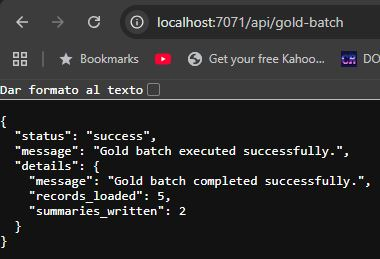
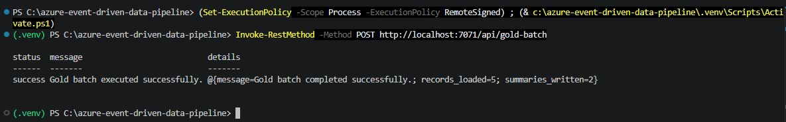

<p align="center">
<a href="../../README.md">Home</a>
</p>

# 🥇 Gold Layer

## 1. Purpose

The Gold layer is responsible for generating **business-ready datasets**.

It transforms curated data into [aggregated metrics](metrics_definition.md) that can be directly consumed for reporting and analytics.

---

## 2. Why Gold Exists

Even clean data is not enough for analytics.

This layer ensures that:

* Metrics are precomputed
* Data is optimized for consumption
* Business logic is consistently applied

---

## 3. Transformation & Enrichment

Unlike previous layers, Gold layer is generated by a **batch process**.

It can be executed on demand via:

a) **HTTP-triggered function:** `gold-batch`



b) **Terminal command:** `Invoke-RestMethod` 


Reference:
* `run_gold_batch_for_today()` → [`\app\gold\gold_aggregations.py`](../../app/gold/gold_aggregations.py)
* [`Aggregated metrics`](metrics_definition.md)

---

## 4. Validation Strategy

Gold does not validate any data, the objective of this layer is to generate aggregate data and business metrics (metadata) 

This ensures that all aggregations are based on **validated and state-consistent data**.

---

## 5. Output Zones

Records are generated into:
* [`daily_order_summary/`](gold_daily_order_summary.jpg) → valid and enriched data

---

## 6. Storage Design (Data Lake)

Gold data is stored in Azure Data Lake Gen2:

```text 
gold/
└── daily_order_summary/
    └── year=YYYY/
        └── month=MM/
            └── day=DD/
```
Partitioning is date-based and generated dynamically at write time.

Each file represents a summary for a given date and currency.

---

## 7. Value Provided

The Gold layer provides:

* Ready-to-use business metrics
* Consistent aggregation logic
* Optimized datasets for reporting
* A stable interface for consumers

---

## 8. Summary

The Gold layer transforms curated data into **actionable insights**.

It is the final step where data becomes:

* Measurable
* Comparable
* Ready for decision-making
