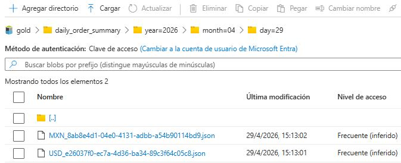

<p align="center">
<a href="../../README.md">Home</a> |
<a href="gold_layer.md">Back</a>
</p>

# Aggregated metrics

## 1. Purpose

This document defines the business metrics generated in the Gold layer.

All metrics are computed from the [current_orders snapshot](../silver/current_orders_snapshot.md), ensuring consistency and reliability.

---

## 2. Aggregation Dimensions

```json id="qz1b2k"
{
  "summary_date": "YYYY-MM-DD",
  "currency_code": "MXN | USD",

  "total_orders": 100,
  "paid_orders": 80,
  "cancelled_orders": 20,
  "high_value_orders": 10,
  "gross_revenue": 50000.00,
  "net_revenue": 42000.00,
  "cancelled_revenue": 8000.00,
  "avg_order_value": 500.00,

  "processing_layer": "gold",
  "pipeline_version": "1.1",
  "processed_at_utc": "ISO8601",
  "data_quality_status": "VALIDATED"
}
```

Metrics are grouped by:

* `summary_date` → derived from the last event timestamp
* `currency_code` → ensures separation of monetary values



---

## 3. Metrics

| Metric | Definition | Logic |
|------- |----------- |-------|
| total_orders | Total number of orders in the dataset. | Count of all records |
| paid_orders | Number of orders with status `PAID` | Count where `is_paid_order = true` |
| cancelled_orders | Number of orders with status `CANCELLED` | Count where `is_cancelled_order = true` |
| high_value_orders | Number of orders classified as high value | Count where `business_priority_flag = HIGH_VALUE` |
| gross_revenue | Total value of all orders, regardless of status | Sum of `order_total` across all records | 
| net_revenue | Revenue from completed (paid and not cancelled) orders | Sum of `order_total` where: `is_paid_order = true`  and `is_cancelled_order != true` |
|cancelled_revenue | Total value of cancelled orders | Sum of `order_total` where `is_cancelled_order = true` |
| avg_order_value | Average value per order | `gross_revenue / total_orders` |

## 4. Metadata Fields

| Field | Definition |
|-------|------------|
| `processing_layer` | Indicates the pipeline layer that generated the record. For this dataset, the value is always `"gold"` |
| `pipeline_version` | Version identifier of the pipeline logic used to generate the dataset. Useful for tracking changes in transformations or aggregations over time. |
| `processed_at_utc` | Timestamp (UTC) indicating when the record was generated in the Gold layer. Supports auditing and traceability |
| `data_quality_status` | Indicates the quality state of the data. For Gold outputs, this is `"VALIDATED"`, meaning all upstream validation rules were successfully applied. |

---

## 5. Summary

These metrics provide a **consistent and business-aligned view of order activity**.

They are designed to support:

* Operational monitoring
* Revenue analysis
* Business performance tracking
