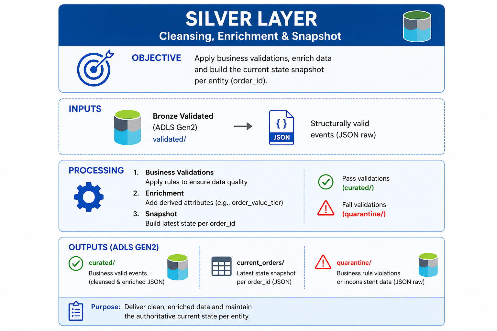

<p align="center">
<a href="../../README.md">Home</a>
</p>



## 1. Purpose

The validation rules and transformations implemented in this layer represent a subset of typical data processing logic, designed to illustrate the pattern and approach used in a Silver layer.

This layer is responsible for **data cleansing, validation, and enrichment**.

It transforms raw events from Bronze into [structured and business-valid records](data_contract.md), generating also the `current_orders` [snapshot dataset](current_orders_snapshot.md).

## 2. Why Silver Exists

Raw data is not reliable enough for analytics.

This layer ensures that:

* Only **valid and meaningful data** moves forward
* Business rules are enforced
* Data is standardized and enriched

## 3. Transformation & Enrichment

Each validated Bronze event is transformed into a normalized structure.

Key transformations fields include:

| Standarized | Derived | Metadata |
|---|---|---|
| `order_id` | `order_value_tier` | `processed_at_utc` |
| `customer_id` | `is_high_value_order` | `pipeline_version` |
| `currency_code` | `event_sequence_rank` | |
||`lifecycle_stage_name`||

Reference:

* [`\app\silver\transformers.py`](../../app/silver/transformers.py)

## 4. Validation Strategy

Unlike Bronze, Silver enforces **business-level validation**:

* Allowed currencies: `MXN`, `USD`
* Allowed statuses: `CREATED`, `PAID`, `CANCELLED`
* `order_total` must be greater than 0

Reference:

* [`\app\silver\validators.py`](../../app/silver/validators.py)

## 5. Output Zones

Records are separated into:

* [`curated/`](silver_curated.jpg) → valid and enriched data
* [`quarantine/`](silver_quarantine.jpg) → invalid records with business rule violations
* [`current_orders/`](silver_current_orders.jpg) → snapshot dataset

Quarantined records include:

* Validation errors
* Original transformed record
* Processing timestamp

This allows debugging without data loss.

## 6. Storage Design (Data Lake)

The Silver layer is stored in **Azure Data Lake Storage Gen2**, using a container-based structure.

```text id="s7v3c3"
silver/
├── curated/
│   └── year=YYYY/
│       └── month=MM/
│           └── day=DD/
├── quarantine/
│   └── year=YYYY/
│       └── month=MM/
│           └── day=DD/
└── current_orders/
    └── year=YYYY/
        └── month=MM/
            └── day=DD/
```

Partitioning is date-based and generated dynamically at write time.

Reference:

* [`\app\shared\writers.py`](../../app/shared/writers.py)

## 7. Additional Role: State Preparation

Beyond validation, the Silver layer prepares data for **stateful modeling**.

Each curated record is used to build the **current state of an order**, which is stored in the [`current_orders`](current_orders_snapshot.md) dataset.

This bridges the gap between:

* Event streams (what happened)
* Business state (what is true now)

## 8. Value Provided

The Silver layer provides:

* Clean and standardized data
* Enforced business rules
* Enriched attributes for analytics
* Isolation of invalid business records
* Foundation for stateful modeling

## 9. Summary

The Silver layer transforms raw events into **trusted, structured data**.

It is the point where data becomes:

* Consistent
* Validated
* Ready for business interpretation
