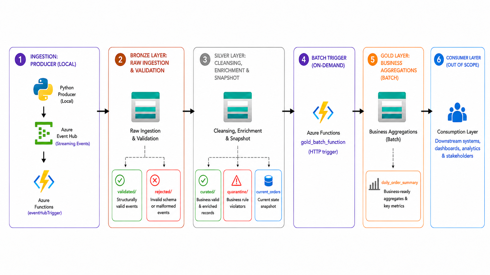
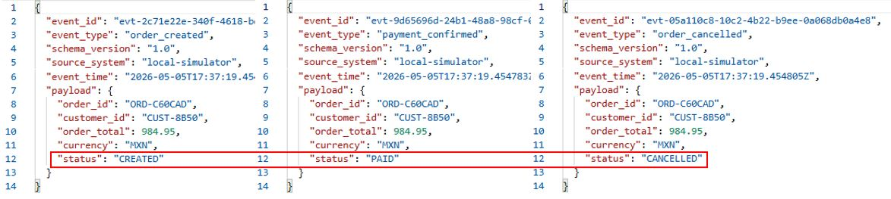
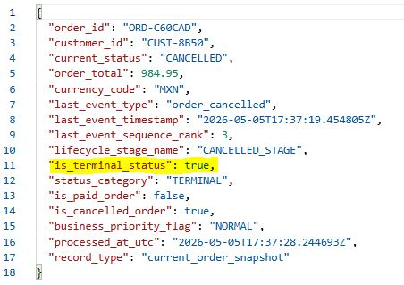
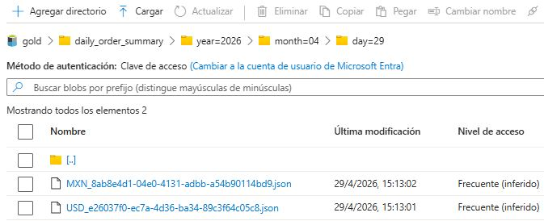
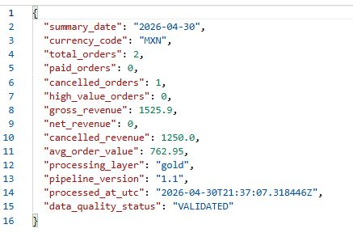

<p align="center">
<a href="../../README.md">Home</a>
</p>

# Testing Scenarios

## 1. Purpose

This document describes the test scenarios used to validate the pipeline behavior across `Bronze`, `Silver`, `Snapshot` and `Gold` layers.

The goal is to verify that each scenario is routed, validated, and processed according to the expected data quality rules.

---

## 2. Scenario Matrix

| Scenario | Primary Validation Target | Purpose | Expected Result |
|----------|---------------------------|---------|-----------------|
| `paid_order` | Snapshot | Validate a normal order lifecycle from creation to payment | Order reaches `silver/current_orders` with status `PAID` |
| `cancelled_order` | Snapshot | Validate cancellation flow | Order reaches `silver/current_orders` with status `CANCELLED` |
| `paid_then_cancelled` | Snapshot | Validate lifecycle progression when an order is paid and later cancelled | Final snapshot reflects `CANCELLED` status |
| `open_order` | Snapshot | Validate an order that has only been created | Snapshot remains in `CREATED` status |
| `high_value_paid` | Silver / Gold | Validate high-value classification logic | Record is flagged as `HIGH_VALUE` and included in Gold metrics |
| `zero_amount` | Silver Quarantine | Validate business rejection for zero-value orders | Event passes Bronze but is routed to `silver/quarantine` |
| `bad_currency` | Silver Quarantine | Validate unsupported currency handling | Event passes Bronze but is routed to `silver/quarantine` |
| `bad_status` | Silver Quarantine | Validate unsupported lifecycle status handling | Event passes Bronze but is routed to `silver/quarantine` |

View [run results](../data_flow/producer_results.md) here.

---

## 3. Layer Validation Coverage

| Layer | What is Tested |
|-------|----------------|
| Bronze | Structural validation, raw event preservation |
| Silver | Business validation, normalization, enrichment, quarantine routing |
| Snapshot | Current order state, lifecycle ordering, overwrite logic |
| Gold | Aggregation from trusted snapshot data |

---

## 4. Expected Data Routing

The following diagram summarizes how records are routed depending on validation results across the pipeline.



This routing model helps verify that valid, invalid, and business-rule-violating records are stored in the correct layer and zone.

---

## 5. Snapshot Validation

The snapshot dataset must keep the latest valid state per `order_id`.

Expected lifecycle priority:

```text 
order_created       → CREATED
payment_confirmed   → PAID
order_cancelled     → CANCELLED
```

For scenarios with multiple events for the same order, the final state should reflect the most advanced lifecycle event.

Bronze validated JSONs for same `order_id`:



Silver `current_orders`:



--- 

## 6. Gold Validation

Gold metrics are generated from `silver/current_orders`.

Expected behavior:

* Only valid snapshot records are aggregated
* Quarantined records are excluded
* Metrics are grouped by `summary_date` and `currency_code`
* Business metadata is added to the output



Key outputs to verify:

* `total_orders`
* `paid_orders`
* `cancelled_orders`
* `high_value_orders`
* `gross_revenue`
* `net_revenue`
* `cancelled_revenue`
* `avg_order_value`



This confirms that Gold outputs are generated only from trusted snapshot records, not directly from raw or quarantined data.

---

## 7. Recommended Demo Scenario

For full pipeline validation, use `portfolio_demo_batch`.

This scenario is recommended because it covers:

* Valid orders
* Cancelled orders
* High-value orders
* Invalid business records
* Snapshot updates
* Gold aggregation

---

## 8. Summary

These scenarios validate that the pipeline can:

* Accept valid events
* Isolate invalid records
* Apply business rules
* Maintain current entity state
* Generate trusted business metrics

The testing strategy focuses on validating pipeline behavior, not only successful execution.


