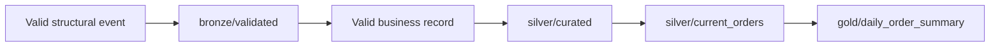

<a href="../../README.md">Home</a>

# Testing Scenarios

## 1. Purpose

This document describes the test scenarios used to validate the pipeline behavior across Bronze, Silver, Snapshot, and Gold layers.

The goal is to verify that each scenario is routed, validated, and processed according to the expected data quality rules.

---

## 2. Scenario Matrix

| Scenario | Purpose | Expected Result |
|----------|---------|-----------------|
| `paid_order` | Validate a normal order lifecycle from creation to payment | Order reaches `silver/current_orders` with status `PAID` |
| `cancelled_order` | Validate cancellation flow | Order reaches `silver/current_orders` with status `CANCELLED` |
| `paid_then_cancelled` | Validate lifecycle progression when an order is paid and later cancelled | Final snapshot must reflect `CANCELLED` status |
| `open_order` | Validate an order that has only been created | Snapshot remains in `CREATED` status |
| `high_value_paid` | Validate high-value classification logic | Record is flagged as `HIGH_VALUE` and included in Gold metrics |
| `zero_amount` | Validate business rejection for zero-value orders | Event passes Bronze but is routed to `silver/quarantine` |
| `bad_currency` | Validate unsupported currency handling | Event passes Bronze but is routed to `silver/quarantine` |
| `bad_status` | Validate unsupported lifecycle status handling | Event passes Bronze but is routed to `silver/quarantine` |

---

## 3. Layer Validation Coverage

| Layer | What is Tested |
|-------|----------------|
| Bronze | Structural validation, raw event preservation, rejected event routing |
| Silver | Business validation, normalization, enrichment, quarantine routing |
| Snapshot | Current order state, lifecycle ordering, overwrite logic |
| Gold | Aggregation from trusted snapshot data |

---

## 4. Expected Data Routing

